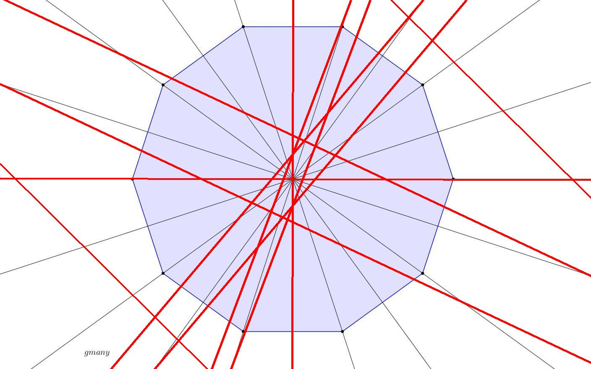
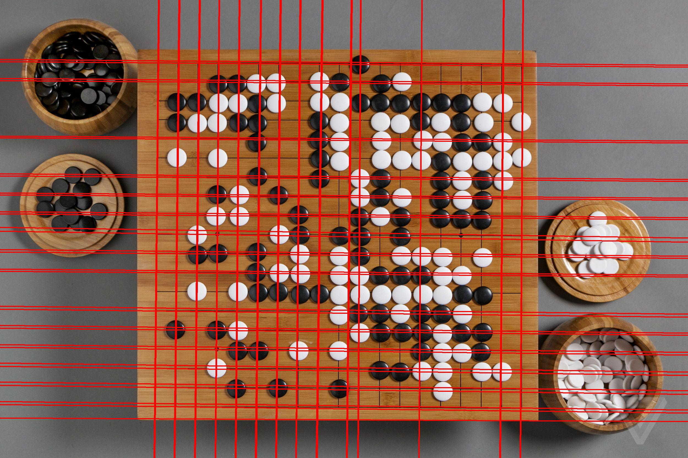

# Fast Hough Transform
Implementation of fast Hough transform. Class **HoughTransforms** can find and draw lines in any direction.

Structure of the repository:

```
FatHoughTransform
├── src
│   ├── hough.py # HoughTransform class
│   └── draw_lines.py # script to find lines on image and draw them
└── samples
    ├── clean # folder with sample images to test
    ├── lines # folder with results of draw_lines.py script
    └── readme # folder with images for readme
```

# 1. Installation
Clone this repository to the local system.
Then install dependencies to your environment.
### 1. with pip
```bash
pip install -r requirements.txt
```

### 2. with poetry
```bash
poetry install
```

To check the compatibility to your system and the correctness of project organization you can use Nox:
```bash
nox
```

Now you can run [draw_lines.py](src/draw_lines.py) script via command
```bash
python3 src/draw_lines.py --image=<your image> --output=<path to save image with lines>
```

To test run this
```bash
python3 src/draw_lines.py -i=./samples/clean/cross.jpg -o=./samples/lines/cross.jpg -q=0.96 -mcs=2 -th=1 -g -l=4
```
Correct output:


# 2. Usage
Basic usage
```
usage: draw_lines.py [-h] --image IMAGE
[--output OUTPUT]
[--quantile QUANTILE]
[--min_cluster_size MIN_CLUSTER_SIZE]
[--vertical VERTICAL]
[--horizontal HORIZONTAL]
[--limit LIMIT]
[--color COLOR]
[--thickness THICKNESS]
[--gradient]
[--edge_detection_method {laplacian,sobel}]
```

To know about all options in detail run
```bash
python3 src/draw_lines.py --help
```

Here is a brief explaination on main options:
## Main options
### --input, -i
Path to image to find lines in.
### --output, -o
Path to save image with lines. The background is `--input` image.
Lines are drawn with specified `--thickness` and  `--color`.

If no `--output` specified the script only finds lines and prints them.

### --quantile, -q
The lines are found by the brightest pixels of the Hough transform.
To find them we get top N% points of the transform.

`N = (1 - quantile) * 100%`

Default quantile is `0.99`, but it can be increased for bigger images and decreased for smaller.

For example I have horizontal-down Hough Transform for `./samples/clean/umbrella.jpg` and its binarization with `--quantile=0.99`


### --min_cluster_size, -mcs
Then we clusterize binarized transform by neightbourhood. We get many noise clusters with small amount of pixels.

`--min_cluster_size` is a minimum size of a cluster to consider it as line presence. To remove noise clusters we requre that cluster must have >=`--min_cluster_size` pixels. It can be number or percentage.

After clusterization:


We select a centroid of each cluster (red triangles). They represent found lines.

## Output
Finally we get a list of found lines and optionally a new image with lines.



Fast Hough transform is not very precise because it handles with tangent with step 1/max(Heigh, Width). And not very fast because the implementation is based on python. But It is an example of the alogithm to find lines in the image.

## Other examples
Command
```
python3 src/draw_lines.py -i=samples/clean/go.jpg -o=samples/lines/go.jpg -q=0.998 -mcs=140
```


Command
```
python3 src/draw_lines.py -i=samples/clean/manylines.jpg -o=samples/lines/manylines.jpg -q=0.99 -mcs=0.0001 -th=5 -c=blue
```


Command
```
python3 src/draw_lines.py -i=./samples/clean/cross.jpg -o=./samples/lines/cross.jpg -q=0.96 -mcs=2 -th=1 -g -l=4
```

